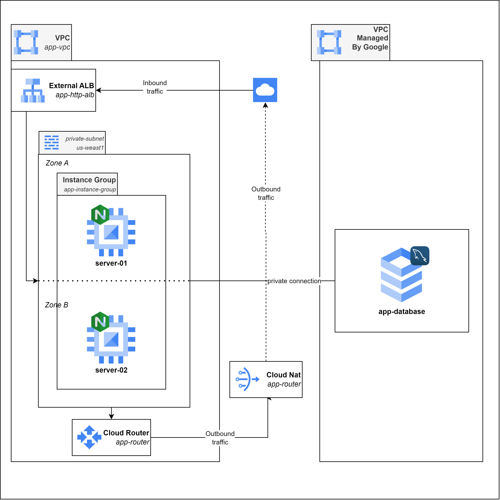

# Terraform project for setting up a basic infraestructure on Google Cloud Platform (GCP)

## Project Overview

This project uses the Terraform to provide and manage GCP resources. The goal is to automate the creation, modification and deletion of a simple infraestructure described below, ensuring a scalable and repeatable infrastructure.

## Project Structure
For each environment, 
- `main.tf`: Defines the main resources such as VM instances, networks, subnetworks and etc.
- `variables.tf`: Declares the variables used in the project, including the specification about their type and default values.
- `outputs.tf`: Defines the outputs, which can be available for other Terraform's modules or just for view.
- `provider.tf`: Setup the GCP (Google Cloud Plataform) provider and your credentials.
- `terraform.tfvars`: File used to specify the variable values, overwriting the default values at `variables.tf`.

## Getting Started

1. **Install Terraform**:
   - Download Terraform [terraform.io](https://www.terraform.io/downloads.html) following the installation instructions.

2. **Create a Project at GCP**:
   - [Creating a GCP Project](https://cloud.google.com/appengine/docs/standard/python3/building-app/creating-gcp-project).

3. **[Create a Service Account](https://cloud.google.com/iam/docs/service-accounts-create) to allow Terraform code to apply changes**. Make sure to assign the following roles:
   - Editor (used to create the most of resources like buckets, VMs);
   - Project IAM Admin (used to assign roles to another service/user accounts);
   - Secret Manager Admin (used to create and update existing secrets);
   - Service Networking Admin (used to apply changes to the network settings)

## Cloud Architecture Diagram

The image below describe the most of principal resources provisioned by Terraform.

